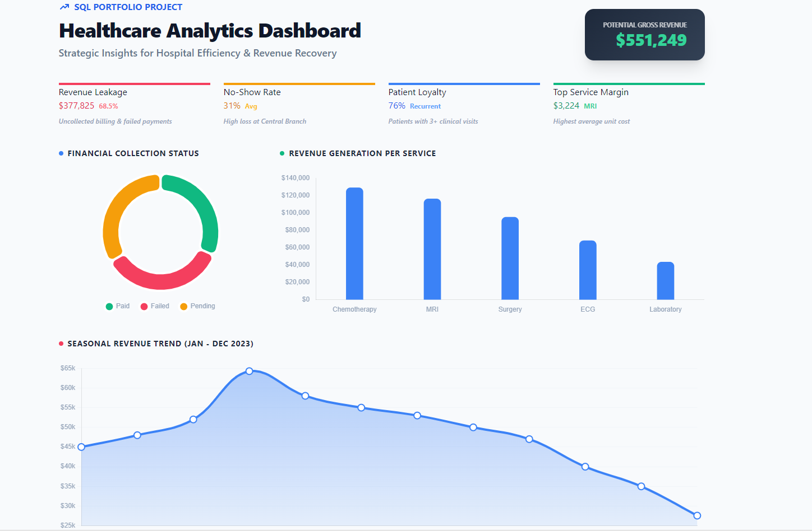
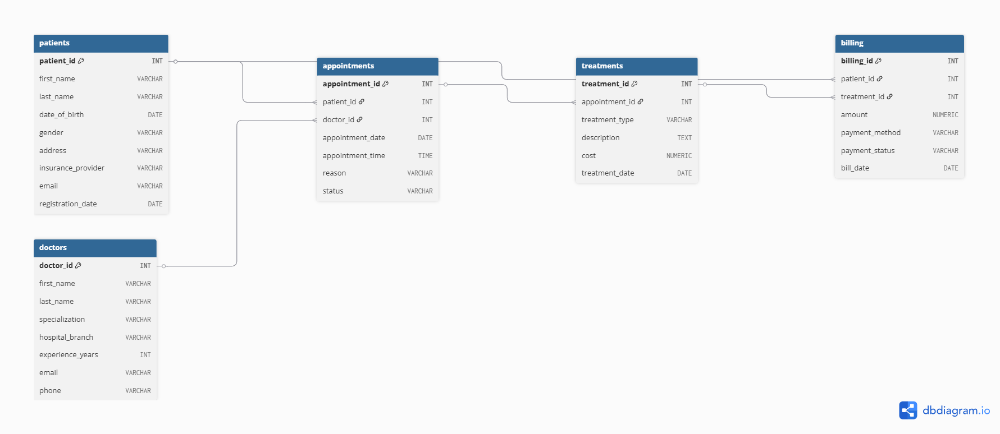

# healthcare-analytics-sql

SQL-based analysis of hospital operations, patient trends, and financial performance.

# 🏥 Hospital Data Analytics | SQL Portfolio Project


## 📊 Data Source

The dataset used in this project was sourced from Kaggle:
**[Hospital Management Dataset](https://www.kaggle.com/datasets/kanakbaghel/hospital-management-dataset)** by Kanak Baghel

It contains synthetic healthcare records, including patient demographics,
clinical visits, and financial transactions.

## 📌 Project Overview

---

This project presents a comprehensive SQL analysis of a hospital
database, covering patient behavior, clinical operations, treatment
patterns, and financial performance.

The analysis was designed to simulate real-world healthcare analytics
tasks — the type of work performed by Medical Data Analysts at
hospitals, NGOs, and health-tech organizations.

---

## 📊 Dashboard Overview

To better communicate the insights derived from this SQL analysis, I have included a conceptual dashboard.



> **Note on Methodology:** As I am currently focusing on mastering SQL for data extraction and analysis, this dashboard was conceptualized and generated using **AI assistance (Claude/Gemini)**. This visual representation is based on the actual query results obtained from the PostgreSQL database, used here to demonstrate how clinical data can be translated into business intelligence.

---

## 🗂 Database Schema (ERD)

Below is the Entity Relationship Diagram showing the connections between Patients, Doctors, Appointments, and Treatments.



---

## 🗄️ Database Structure

| Table | Rows | Description |
|-------|------|-------------|
| patients | 50 | Demographics and insurance data |
| doctors | 10 | Specialization and branch info |
| appointments | 200 | Visit records and status |
| treatments | 200 | Procedures and costs |
| billing | 200 | Payment records and methods |

---

## 🔍 Analysis Sections

### 👥 1. Patient Demographics & Retention

* Gender and age group distribution
* Loyal patient identification (3+ visits)
* Insurance provider market share

### 🩺 2. Clinical Operations & Efficiency

* Doctor workload ranking
* No-show rate analysis by doctor
* Branch performance comparison

### 💊 3. Treatment & Service Insights

* Most performed treatments
* Revenue contribution by treatment type
* Average cost analysis

### 💰 4. Financial Health & Revenue Trends

* Monthly revenue dynamics
* Cumulative revenue (Running Total)
* Payment status and collection risk
* Payment method preferences

---

## 💡 Key Findings

* **76%** of patients are returning visitors (3+ visits)
* **Central Hospital** handles 42% of appointments but has
the highest no-show rate (**31%**)
* **MRI** has the highest average cost per treatment (**$3,224**)
* Only **31.5%** of billing is collected —
**$377,825 in uncollected revenue** ⚠️
* **April** was the strongest revenue month (**$64,271**)

---
👉 **For a more detailed breakdown of the analysis and business recommendations, check out the [Detailed Findings](insights/final_report.md).**

---

## 🛠️ Tools Used

* **PostgreSQL** — Database and query execution
* **pgAdmin** — Database management
* **Git & GitHub** — Version control and portfolio
* **AI Assistance (Gemini/Claude)** — Used for conceptualizing data visualizations and structuring the final report.

---

## 📁 Project Structure

```text
healthcare-analytics-sql/
├── data/
│   ├── appointments.csv
│   ├── billing.csv
│   ├── doctors.csv
│   ├── patients.csv
│   └── treatments.csv
├── schema/
│   ├── create_tables.sql
│   └── erd_schema.png
├── analysis/
│   ├── 00_overview.sql
│   ├── 01_patient_analysis.sql
│   ├── 02_doctor_analysis.sql
│   ├── 03_treatment_analysis.sql
│   └── 04_financial_analysis.sql
├── insights/
│   ├── dashboard_analysis.png
│   └── final_report.md
└── README.md
```

---

## 🚀 How to Run

1. **Install PostgreSQL and pgAdmin**: Make sure you have them installed on your machine.
2. **Create a new database**: Name it `healthcare_project`.
3. **Create schema**: Run the command `CREATE SCHEMA analytics;`.
4. **Run Tables Script**: Execute the SQL code in `schema/create_tables.sql` to set up the structure.
5. **Import Data**: Import the CSV files from the `data/` folder into their respective tables using pgAdmin Import tool.
6. **Analyze**: Execute the queries from the `analysis/` folder in order to see the results.

---

## ⚠️ Limitations

* Dataset contains **50 patients and 200 appointments** — results are directional and not statistically generalizable.
* Data is **synthetic**, meaning it may not reflect the full complexity of real-world clinical workflows.
* Analysis covers a **single fiscal year (2023)** — longitudinal trends cannot be assessed.
* No patient identifiers or sensitive data are included, in line with data privacy best practices.

---

## 👤 Author

**Arpenik**
*Radiologist transitioning into Health Data Analytics.*
*Focused on SQL, healthcare data, and clinical insights.*

[](https://www.linkedin.com/in/arpenik-mesropyan-694193219)
[](https://github.com/arpidata)
